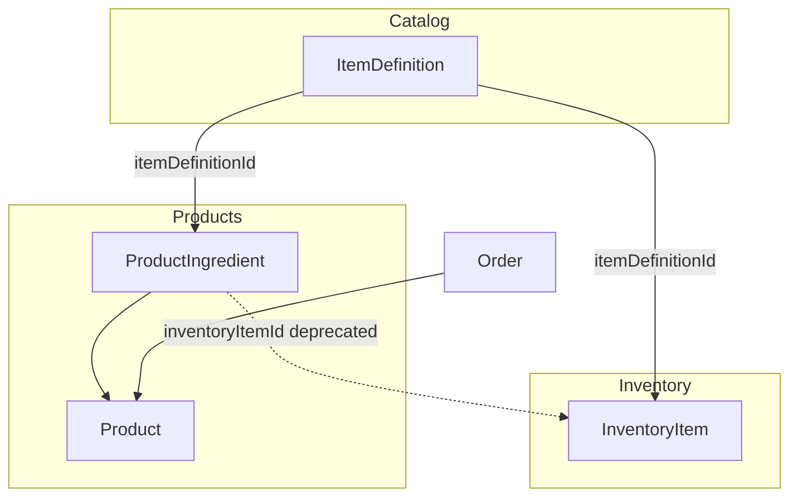

# Implementation Plan: Link Catalog (ItemDefinition) to Inventory and Products

**Goal:** Move from free-text/specific-item dependency to definition-based dependency. Inventory items become *instances* of a catalog definition; product recipes reference *definitions* instead of specific inventory items.

**Order:** Schema first → Inventory module → Products module (including Orders reservation logic).

---

## 1. Database Schema Updates

**File:** [prisma/schema.prisma](prisma/schema.prisma)

### 1.1 ItemDefinition (existing)

- No changes. Already has: `id`, `name`, `category`, `properties`, `description`.

### 1.2 InventoryItem

- **Add** `itemDefinitionId Int?` (optional for migration; existing rows stay null).
- **Add** relation: `itemDefinition ItemDefinition? @relation(fields: [itemDefinitionId], references: [id])`.
- **Keep** `name String` — used as display name: when `itemDefinitionId` is set, derive from definition (e.g. `definition.name` + optional note); when null (legacy), keep current free-text name.
- **Add** index: `@@index([itemDefinitionId])`.
- **Add** reverse relation on `ItemDefinition`: `inventoryItems InventoryItem[]`.

**Migration strategy:** New column nullable. Existing inventory items remain without a definition; new items created via Add Item dialog will have `itemDefinitionId` set when user selects a definition.

### 1.3 ProductIngredient

- **Add** `itemDefinitionId Int?` (optional for migration).
- **Add** relation: `itemDefinition ItemDefinition? @relation(fields: [itemDefinitionId], references: [id])`.
- **Deprecate** `inventoryItemId`: make it **optional** (`inventoryItemId String?`) so existing data keeps working; new recipes use only `itemDefinitionId`.
- **Update** unique constraint: either `@@unique([productId, itemDefinitionId])` when using definitions, or keep `@@unique([productId, inventoryItemId])` for legacy; Prisma allows only one @@unique per pair — use `@@unique([productId, inventoryItemId])` and add a separate `@@unique([productId, itemDefinitionId])` only if both can be non-null. Simpler: keep `inventoryItemId` optional, add `itemDefinitionId` optional; enforce in application that exactly one of them is set for new ingredients; unique on `[productId, inventoryItemId]` and `[productId, itemDefinitionId]` (two partial uniques are not trivial in SQL). **Recommended:** Add `itemDefinitionId Int?`, keep `inventoryItemId String?` (make optional). Remove `@@unique([productId, inventoryItemId])` and add `@@unique([productId, inventoryItemId])` only where inventoryItemId is not null — Prisma does not support partial uniques. So: keep both columns optional; add a check constraint or app-level validation that (inventoryItemId XOR itemDefinitionId). For migration, keep `@@unique([productId, inventoryItemId])` and add a new unique for definition-based: `@@unique([productId, itemDefinitionId])` — but then one of the two FKs must be null. So: `productId` + `inventoryItemId` unique when inventoryItemId not null; `productId` + `itemDefinitionId` unique when itemDefinitionId not null. Prisma: use `@@unique([productId, inventoryItemId])` and `@@unique([productId, itemDefinitionId])` — both optional fields, so multiple nulls are allowed; ensure app never creates two rows with same (productId, null, X) or (productId, X, null). Actually in PostgreSQL two nulls in a unique column are considered distinct, so we can have two ingredients with (productId, null, defId1) and (productId, null, defId2). And (productId, invId1, null) and (productId, invId2, null). So we need `@@unique([productId, inventoryItemId])` only when inventoryItemId is not null — Prisma doesn't support partial unique. Easiest: add `itemDefinitionId`, make `inventoryItemId` optional. Keep unique on `[productId, inventoryItemId]` — for legacy rows; for new rows with itemDefinitionId, inventoryItemId is null, so we need unique on [productId, itemDefinitionId]. Add `@@unique([productId, itemDefinitionId])`. Both uniques can coexist: one row can't have both IDs set (enforce in app).
- **Add** index: `@@index([itemDefinitionId])`.
- **Add** reverse relation on `ItemDefinition`: `productIngredients ProductIngredient[]`.

**Summary for ProductIngredient:**

- `inventoryItemId String?` (optional)
- `itemDefinitionId Int?` (optional)
- Relation `inventoryItem` optional; relation `itemDefinition` optional
- Application rule: for new ingredients, set only `itemDefinitionId`; for legacy, `inventoryItemId` is set. When loading, prefer `itemDefinition` for display if present.

### 1.4 Migration

- Create migration (e.g. `add_catalog_links`).
- **Optional data migration:** Backfill `InventoryItem.itemDefinitionId` by matching `InventoryItem.name` to `ItemDefinition.name` (update where match is unique). Backfill `ProductIngredient.itemDefinitionId` from `ingredient.inventoryItem.itemDefinitionId` (after inventory backfill) or from `inventoryItem.name` → `ItemDefinition.name`.

---

## 2. Inventory Module Updates

### 2.1 Server action: `addInventoryItem`

**File:** [src/app/actions/inventory.ts](src/app/actions/inventory.ts)

- **Schema (addInventoryItemSchema):**
  - Add `itemDefinitionId: z.number().int().positive().optional()`.
  - Add `note: z.string().optional()` (custom note; concatenated to display name).
  - Keep `name` optional when `itemDefinitionId` is provided; when `itemDefinitionId` is set, resolve name from definition (+ note). When `itemDefinitionId` is absent (legacy path), require `name` as now.
- **Logic:**
  - If `itemDefinitionId` provided: fetch `ItemDefinition`; set `name = definition.name + (note ? ' – ' + note : '')`; set `itemDefinitionId` on created rows.
  - If `itemDefinitionId` not provided: use `name` from payload (current behavior), leave `itemDefinitionId` null.
- **Validation:** Require either `name` (min 1) or `itemDefinitionId`; if both, prefer definition-based name.

**File:** [src/lib/schemas/](src/lib/schemas/) — add or extend inventory schema if validation lives there.

### 2.2 UI: Add Item Dialog

**File:** [src/components/inventory/add-item-dialog.tsx](src/components/inventory/add-item-dialog.tsx)

- **Data:** Call `getAllItemDefinitions()` (already exists) to populate definition combobox.
- **Replace** the main "Název" text input with:
  - **Combobox** for selecting an `ItemDefinition` (options: definition name + optional category label). Value: `itemDefinitionId` or null.
  - Optional **Note** field (single line): mapped to the "custom note" appended to definition name when saving.
- **When a definition is selected:**
  - Show **Category** (read-only), e.g. "Kategorie: Deskový materiál" from definition's category (no DB field on InventoryItem; display only).
  - Optionally disable or hide a redundant category input if it existed.
- **Dimensions and price:** Unchanged (width, height, thickness, quantity, total price).
- **Submit payload:** `itemDefinitionId` (if selected), `note` (optional), dimensions, quantity, totalPrice. Action derives `name` from definition + note.
- **Legacy / no definition:** Allow "no definition" (empty combobox) and show a single "Název" text field so existing free-text flow still works; or require definition and drop free-text (product decision).

**Recommended:** Require definition selection (no free-text) so all new items are definition-based. If product wants to support legacy add without definition, keep optional definition + fallback name field.

---

## 3. Product Module Updates

### 3.1 Schemas

**File:** [src/lib/schemas/products.ts](src/lib/schemas/products.ts)

- **Ingredient schema:** Replace `inventoryItemId` with `itemDefinitionId` for new recipes.
  - `itemDefinitionId: z.number().int().positive()` (required for new ingredients).
  - `quantity: z.number().positive()`.
  - Optional: `width`, `height` (for "required dimensions" per ingredient) if product wants to store them; otherwise omit.
- **CreateProductInput / UpdateProductInput:** `ingredients` array of `{ itemDefinitionId, quantity }` (and optional dimensions if added to schema).

### 3.2 Server actions: `createProduct` / `updateProduct`

**File:** [src/app/actions/products.ts](src/app/actions/products.ts)

- **createProduct:** Accept `ingredients` with `itemDefinitionId` (and optional dimensions). Create `ProductIngredient` with `productId`, `itemDefinitionId`, `quantity`; set `inventoryItemId` to null for new ingredients.
- **getProducts:** Include `ingredients` with `itemDefinition` (select id, name, category) instead of or in addition to `inventoryItem`. For display, use `ingredient.itemDefinition?.name ?? ingredient.inventoryItem?.name` (support legacy).
- **Delete/update product:** No schema change beyond ingredient shape; ensure update product (if exists) writes `itemDefinitionId` and leaves `inventoryItemId` null for new ingredients.

### 3.3 UI: Product ingredients (Recipe editor + Create product dialog)

**File:** [src/components/products/recipe-editor.tsx](src/components/products/recipe-editor.tsx)

- **Props:** Replace `availableItems: InventoryItem[]` with `definitions: ItemDefinition[]` (from `getAllItemDefinitions()`).
- **RecipeIngredient type:** Use `itemDefinitionId: number` and `quantity: number`; optionally `width?: number`, `height?: number` if required.
- **Combobox:** Options from `definitions` (e.g. label: `definition.name`, value: `definition.id`). Placeholder e.g. "Vyberte definici položky".
- **List display:** Show definition name and quantity (e.g. "Bříza 18mm × 2"). Optionally show dimensions if stored.
- **Quantity:** Keep current input.
- **Dimensions:** Add optional width/height inputs per ingredient if required by product; otherwise omit.
- Remove dependency on `getInventoryItems()` for this combobox; use `getAllItemDefinitions()`.

**File:** [src/components/products/create-product-dialog.tsx](src/components/products/create-product-dialog.tsx)

- **Data:** Call `getAllItemDefinitions()` instead of (or in addition to) `getInventoryItems()` for the recipe editor.
- **Pass** `definitions` into `RecipeEditor`; ingredient state: `{ itemDefinitionId, quantity }`.
- **Submit:** Build `ingredients: [{ itemDefinitionId, quantity }, ...]` and call `createProduct` with that.
- **Validation:** Ensure each ingredient has `itemDefinitionId` and positive quantity; no longer validate `inventoryItemId`.

### 3.4 Product list / detail display

- **Products list page** ([src/app/products/page.tsx](src/app/products/page.tsx)): Ingredients summary currently uses `ingredient.inventoryItem.name`. Change to `ingredient.itemDefinition?.name ?? ingredient.inventoryItem?.name` (and ensure API returns `itemDefinition`).
- **Order detail** (if it shows product ingredients): Same display logic.

---

## 4. Orders: Reservation Logic (Definition-Based)

**File:** [src/app/actions/orders.ts](src/app/actions/orders.ts)

Reservation currently: group by `inventoryItemId`, get reference item's `name`, find AVAILABLE items with same `name`.

- **New logic:** Group required inventory by **itemDefinitionId** (from each product ingredient's `itemDefinitionId`; if legacy ingredient has only `inventoryItemId`, resolve to definition via that item's `itemDefinitionId` or skip if null).
- For each `(itemDefinitionId, requiredQty)`:
  - Find AVAILABLE inventory items where `itemDefinitionId = X` (and `reservedQuantity = 0`).
  - Reserve/consume/release those items (same as now, but filter by `itemDefinitionId` instead of by name).
- **Include** in order fetch: `product.ingredients` with `itemDefinition` (and optionally `inventoryItem` for legacy). Use `ingredient.itemDefinitionId` for the requirements map; if only `inventoryItemId` present (legacy), get that item's `itemDefinitionId` or fall back to matching by name for reservation.

**Concrete steps:**

- In `updateOrderStatus`, when building `inventoryRequirements`, use a `Map<number, number>` (itemDefinitionId → required qty). For each ingredient, if `itemDefinitionId` set use it; else if `inventoryItemId` set, load that item's `itemDefinitionId` (or name) and resolve.
- When reserving/finding items: `where: { itemDefinitionId: defId, status: 'AVAILABLE', reservedQuantity: 0 }` (and same for release/consume with `reservedQuantity > 0`).

---

## 5. Data Handling & Shared Hooks

- **getAllItemDefinitions:** Already in [src/app/actions/item-definitions.ts](src/app/actions/item-definitions.ts). Use it in:
  - Add Item Dialog (inventory).
  - Recipe Editor / Create Product Dialog (products).
- No new API required; ensure both dialogs can call the same action (client-side).

---

## 6. Optional / Follow-Up

- **Inventory list grouping:** Group by `itemDefinitionId` (then name) instead of only by `name`, so all "Bříza 18mm" instances group together even if notes differ.
- **Cut dialog / remnants:** When creating remnants, copy `itemDefinitionId` from the original item so new pieces stay linked to the same definition.
- **Deprecate inventoryItemId on ProductIngredient:** After backfill and UI cutover, stop writing `inventoryItemId`; eventually remove the column and relation (second migration).
- **Validation:** Add server-side rule: new ProductIngredient must have exactly one of `itemDefinitionId` or `inventoryItemId` (XOR).

---

## 7. File Checklist (Summary)

| Area        | Action |
|------------|--------|
| Schema     | Add `InventoryItem.itemDefinitionId` + relation; add `ProductIngredient.itemDefinitionId`, make `inventoryItemId` optional, add relations and uniques; run migration. |
| Inventory  | Extend add schema with `itemDefinitionId` + `note`; in `addInventoryItem`, resolve name from definition + note, set `itemDefinitionId`. |
| Add dialog | Replace name input with ItemDefinition combobox + note; show category from definition (read-only); call `getAllItemDefinitions`. |
| Products   | Schema: ingredient by `itemDefinitionId` (+ optional dimensions); createProduct/updateProduct and getProducts use `itemDefinition`. |
| RecipeEditor | Combobox from definitions; ingredient type `itemDefinitionId` + quantity; display definition name. |
| Create product dialog | Use definitions for RecipeEditor; submit ingredients with `itemDefinitionId`. |
| Products list/detail | Display ingredient name via `itemDefinition?.name ?? inventoryItem?.name`. |
| Orders     | Reservation map by itemDefinitionId; find inventory by `itemDefinitionId`; support legacy ingredients via inventoryItemId → itemDefinitionId/name. |

---

## 8. Diagram (High-Level)

- **Reservation flow:** Order → Product → ProductIngredient (itemDefinitionId) → required qty per definition → InventoryItem (itemDefinitionId + AVAILABLE) → reserve/consume.
